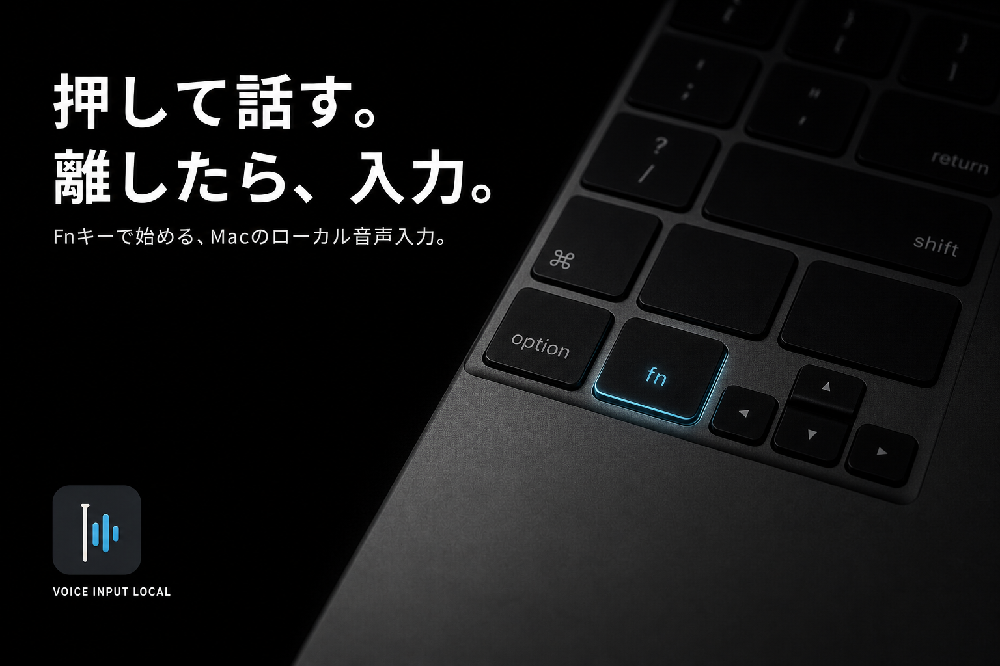

<p align="center">
  
</p>

# Voice Input Local

音声入力だけを担当する、Dockに表示されないmacOSメニューバー常駐アプリです。

Fnを押している間だけ録音し、キーを離すとローカルで文字起こしします。認識結果は、話し始めた時にフォーカスしていた入力欄へ直接反映されます。

## 特徴

- Fnなどのホールド中だけマイクを使用
- Apple SpeechAnalyzerによるローカル文字起こし
- ホールド開始時の入力欄を保持して認識結果を直接入力
- 新しい公開版の自動確認・ダウンロード・更新
- Unicode入力、Accessibility、Command+Vのフォールバック
- クリップボードへのコピーと最大500件の入力履歴
- 入力中のフローティングHUD
- ログイン時の自動起動

24時間録音、システム音声取得、会議管理、要約、Todo生成は含みません。

## 必要環境

- macOS 26以降
- Apple Silicon Mac
- Xcode 26 / Swift 6.3

## インストール

[最新の公証済みDMG](https://github.com/pon-3218/mac-voice-typing/releases/latest/download/Voice-Input-Local-macOS.dmg)をダウンロードし、`Voice Input Local.app`をアプリケーションフォルダへ移動します。

初回起動時にマイクとアクセシビリティの許可が必要です。

初回起動時には、Fnを押して話し、離して入力するまでのオンボーディングが表示されます。完了後はMacへのログイン時に自動で起動し、メニューバーで待機します。自動起動は設定から変更できます。

起動後はメニューバーのテキストカーソルアイコンから設定と履歴を開けます。マイク権限の要求はDeveloper ID署名とAudio Input entitlementを含む配布版から行います。

同じReleaseにある`.sha256`ファイルでダウンロードしたDMGのSHA-256を照合できます。

ソースからローカルビルドする場合:

```bash
git clone https://github.com/pon-3218/mac-voice-typing.git
cd mac-voice-typing
./install-app.sh
```

`/Applications/VoiceInputLocal.app`へインストールされ、メニューバーに常駐します。

開発ビルドでmacOSの権限が失効しないよう、初回インストール時にローカル専用の安定したコード署名証明書を作成します。秘密鍵はMacのローカルキーチェーンに保存され、リポジトリには含まれません。

## 開発

```bash
swift test
swift build
./build-app.sh
```

公開用DMGの作成方法は[`docs/DISTRIBUTION.md`](docs/DISTRIBUTION.md)を参照してください。

## プライバシーとセキュリティ

音声認識はMac上で実行され、アプリにネットワーク通信や広告SDKはありません。入力履歴はローカルに保存されます。詳細は[PRIVACY.md](PRIVACY.md)を参照してください。

脆弱性は公開Issueではなく、[Security Policy](SECURITY.md)に従って非公開で報告してください。通常の不具合や改善はIssue、変更提案はPull Requestを使用してください。

開発参加手順は[CONTRIBUTING.md](CONTRIBUTING.md)、行動規範は[CODE_OF_CONDUCT.md](CODE_OF_CONDUCT.md)を参照してください。

## ライセンス

[MIT License](LICENSE)
